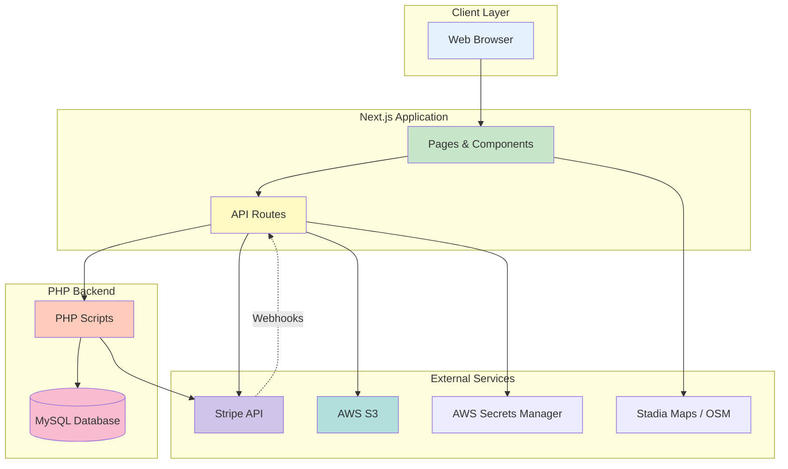

# Architecture Overview

This document provides a high-level overview of the Traino system architecture, data flow, and technology stack.

---

## System Overview

Traino is a **hybrid monorepo** combining Next.js (frontend + API routes) with a traditional PHP/MySQL backend. The system facilitates marketplace transactions between trainers and trainees, handling discovery, booking, payments, and content delivery.

### Key Components

1. **Frontend** (Next.js + React)
   - User-facing pages (trainer discovery, booking, profiles)
   - Admin dashboard
   - Real-time map visualization with clustering
   - Calendar scheduling UI

2. **Next.js API Routes** (`/app/api`)
   - Stripe webhook handlers
   - AWS S3 file operations
   - Session token generation
   - Proxy endpoints to PHP backend

3. **PHP Backend** (`/php`)
   - Core business logic (bookings, transactions, user management)
   - Database operations (MySQL via PDO)
   - Stripe payout processing
   - Cron job endpoints

4. **MySQL Database**
   - User accounts, trainer profiles, products
   - Session schedules (with RRule support)
   - Transactions and bookings
   - Encrypted sensitive data (email, phone, personal numbers)

5. **External Services**
   - **Stripe**: Payment processing, Connect accounts, webhooks
   - **AWS S3**: File/image storage with WebP conversion
   - **AWS Secrets Manager**: BankID certificates
   - **Firebase**: Authentication utilities (optional)
   - **Stadia Maps / OSM**: Map tiles and geolocation

---

## Architecture Diagram



---

## Data Flow Examples

### 1. Trainer Discovery & Booking

```
1. User browses map (Leaflet + Supercluster)
   → Frontend fetches trainers via /api/map/gettotalearnings
   → PHP queries users table (lat/lng, categories)
   → Returns JSON with trainer locations

2. User selects trainer and session
   → Frontend displays calendar (FullCalendar)
   → PHP returns pass_set schedules with RRule

3. User initiates checkout
   → Frontend calls /api/stripe/payment-intent
   → Stripe creates PaymentIntent
   → Client completes payment via Stripe.js

4. Payment succeeds
   → Stripe webhook hits /api/stripe (route.js)
   → Handler validates signature, queues event
   → Updates transactions table with payment_intent_id

5. Booking confirmed
   → Frontend calls /php/booking.php
   → PHP verifies PaymentIntent status via Stripe API
   → Checks for idempotency (payment_intent_id)
   → Validates no time conflicts
   → Inserts pass_booked record
   → Returns success
```

### 2. Monthly Payout Processing

```
1. Cron triggers /php/transferpayoutsstripe.php on 28th
   → Queries transactions with payout_status='pending'
   → Groups by trainer_id, sums trainer_amount (85%)

2. For each trainer:
   → Generates UUID idempotency key
   → Calls Stripe Transfer API to trainer's stripe_id
   → Updates transactions: payout_status='completed', stripe_transfer_id, payout_date

3. Error handling:
   → Missing stripe_id: skip and log
   → Transfer fails: rollback, set payout_status='failed'
   → Retry logic via idempotency key
```

### 3. File Upload to S3

```
1. User uploads image (profile, certificate, etc.)
   → Frontend sends base64 + metadata to /api/aws/upload-img

2. API route processes:
   → Validates file type (JPEG, PNG, WebP, PDF)
   → Converts images to WebP using Sharp (80% quality)
   → Generates S3 key: {user_id}/{folder}/{filename}.webp

3. Uploads to S3:
   → PutObjectCommand with cache-control headers
   → Returns S3 key and URL

4. Frontend stores reference:
   → Calls PHP endpoint to save file_names in user_files table
```

---

## Technology Stack

### Frontend

| Technology | Purpose |
|------------|---------|
| Next.js 14 (App Router) | React framework with SSR/SSG, API routes |
| React 18 | UI library |
| Leaflet + React-Leaflet | Interactive maps |
| Supercluster | Marker clustering for performance |
| FullCalendar | Trainer schedule calendar |
| RRule | Recurring event handling |
| Stripe.js | Client-side payment UI |
| Sharp | Server-side image processing (WebP) |
| Framer Motion | Animations |

### Backend

| Technology | Purpose |
|------------|---------|
| PHP 8+ | Server-side scripting |
| PDO (MySQL) | Database abstraction |
| Composer | PHP dependency management |
| Stripe PHP SDK | Server-side Stripe operations |
| OpenSSL | AES-256 encryption for sensitive fields |

### Database

- **MySQL 8+** with UTF-8MB4 (emoji support)
- **Indexes**: Optimized for geospatial queries, payment lookups, payout processing
- **Unique Constraints**: `payment_intent_id`, `idempotency_key` (prevent duplicates)

### Infrastructure

| Service | Purpose |
|---------|---------|
| Vercel | Next.js hosting (serverless) |
| Traditional Hosting | PHP/MySQL (Apache/Nginx + PHP-FPM) |
| AWS S3 (eu-north-1) | File storage (images, documents) |
| AWS Secrets Manager | Secure certificate storage (BankID) |
| Stripe Connect | Trainer payment accounts |
| Stadia Maps / OSM | Map tiles |

---

## Key Design Patterns

### 1. Idempotency

- **Problem**: Network retries, webhook replays can cause duplicate bookings/transactions
- **Solution**:
  - Unique indexes on `payment_intent_id` (pass_booked, transactions)
  - Unique index on `idempotency_key` (transactions)
  - Pre-flight checks before inserts (SELECT then INSERT)

### 2. Event-Driven Architecture (Webhooks)

- **Stripe Webhooks** (`/api/stripe/route.js`):
  - Signature verification via `stripe.webhooks.constructEvent`
  - Queued processing (max concurrency: 10) with retry logic
  - Immediate 200 response to Stripe to prevent timeouts
  - Exponential backoff on failures (max 3 retries)

### 3. Revenue Split (85/15)

- **Implementation** (`/php/transactions.php`):
  ```php
  $gross_amount = $price * 100; // SEK to öre
  $trainer_amount = (int) round($gross_amount * 0.85);
  $platform_fee = $gross_amount - $trainer_amount;
  ```
- **Payout** (`/php/transferpayoutsstripe.php`):
  - Monthly Stripe Transfers of aggregated `trainer_amount`
  - Platform fee remains in Stripe account balance

### 4. Geospatial Queries

- **Bounding Box** (`/php/getproducts_bounds.php`):
  ```sql
  WHERE latitude BETWEEN :south AND :north
    AND longitude BETWEEN :west AND :east
  ```
- **Frontend Clustering** (Supercluster):
  - Client-side clustering for performance
  - Reduces marker load on map zoom out

### 5. Conflict Detection

- **Booking Overlaps** (`/php/booking.php`):
  ```sql
  WHERE trainer_id = :trainer_id
    AND booked_date = :booked_date
    AND canceled = 0
    AND (:starttime < endtime AND :endtime > starttime)
  ```
- **Schedule Overlaps** (`/php/schedulepass.php`):
  - Validates new schedules against existing pass_set intervals
  - Multilingual error messages (EN/SV)

---

## Security Considerations

- **API Authentication**: Bearer token (`Authorization` header) validated on all PHP endpoints
- **CORS**: Restricted to `traino.nu` domain (commented out for localhost dev)
- **Encryption**: AES-256 for email, phone, personal numbers (ENCRYPTION_KEY)
- **Stripe Webhook Verification**: HMAC signature check prevents spoofed requests
- **SQL Injection Prevention**: PDO prepared statements with bound parameters
- **Session Management**: Secure tokens, expiration, and cleanup via cron

See [SECURITY.md](../SECURITY.md) for full details.

---

## Scalability & Performance

### Current Optimizations

1. **Database Indexes**: Composite indexes on high-traffic queries (lat/lng, payout_status + trainer_id)
2. **Client-Side Clustering**: Supercluster reduces DOM load for maps
3. **Image Optimization**: WebP conversion with Sharp (80% quality) reduces bandwidth
4. **Webhook Queue**: Asynchronous processing prevents webhook timeout failures
5. **CDN**: S3 objects served via CloudFront (optional, not currently configured)

### Future Improvements

<!-- TODO: clarify -->
- **Redis Caching**: Cache trainer listings, user sessions
- **Read Replicas**: Separate MySQL read/write for high traffic
- **Message Queue**: Replace webhook queue with SQS/RabbitMQ for durability
- **GraphQL**: Replace REST API with GraphQL for flexible queries
- **Microservices**: Split payments, scheduling, notifications into separate services

---

## Environment-Specific Behavior

| Environment | Base URL | Database | Stripe | S3 Bucket |
|-------------|----------|----------|--------|-----------|
| **Local** | `https://localhost:3000` | Local MySQL | Test keys | `traino` (test) |
| **Staging** | `https://development.traino.nu` | Staging MySQL | Test keys | `traino-staging` |
| **Production** | `https://traino.nu` | Production MySQL | Live keys | `traino` (prod) |

See [ENVIRONMENT.md](ENVIRONMENT.md) for detailed configuration.

---

## Related Documentation

- [Database Schema](DATABASE.md)
- [Payment Flow](PAYMENTS.md)
- [Webhook Handlers](WEBHOOKS.md)
- [Scheduling System](SCHEDULING.md)
- [File Storage](STORAGE_S3.md)

---

**Last Updated**: 2025-11-03
