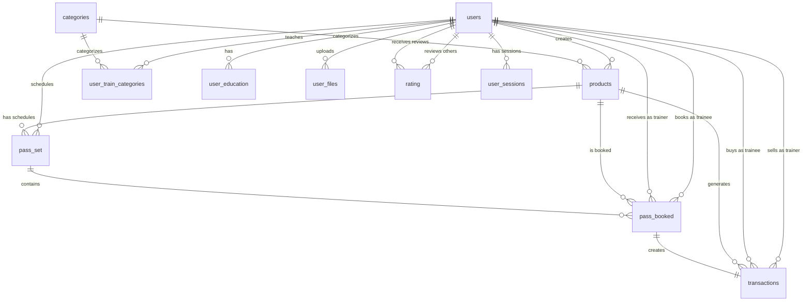

# Database Schema

This document describes the Traino MySQL database schema, including tables, relationships, indexes, and key constraints.

---

## Overview

The Traino database uses **MySQL 8+** with UTF-8MB4 encoding (full Unicode support, including emojis). The schema is automatically created by accessing `/php/db.php` once after deployment.

**Key Features**:
- **Encrypted Fields**: Email, phone, personal numbers use AES-256 encryption (VARBINARY storage)
- **Idempotency**: Unique indexes on `payment_intent_id` and `idempotency_key` prevent duplicate transactions
- **Geospatial Indexing**: Composite indexes on latitude/longitude for map queries
- **Referential Integrity**: Foreign key relationships via indexes (not enforced FK constraints for flexibility)

---

## Core Tables

### users

Stores trainer and trainee accounts.

| Column | Type | Description |
|--------|------|-------------|
| id | INT(30) PK | Auto-increment user ID |
| usertype | VARCHAR(255) | `trainer`, `trainee`, `admin` |
| firstname | VARCHAR(255) | First name (plaintext) |
| lastname | VARCHAR(255) | Last name (plaintext) |
| gender | VARCHAR(255) | Gender identity |
| email | VARBINARY(255) | **Encrypted** with AES-256 |
| alias | VARCHAR(255) | Public username (indexed) |
| mobilephone | VARBINARY(100) | **Encrypted** phone number |
| personalnumber | VARBINARY(50) | **Encrypted** Swedish personnummer |
| youtube_id | VARCHAR(255) | YouTube channel ID |
| hourly_price | INT(30) | Hourly rate in SEK (default 0) |
| user_area | VARBINARY(255) | **Encrypted** city/region |
| user_address | VARBINARY(255) | **Encrypted** street address |
| user_areacode | VARBINARY(255) | **Encrypted** postal code |
| latitude | DECIMAL(10,8) | Geolocation latitude |
| longitude | DECIMAL(11,8) | Geolocation longitude |
| user_password | VARCHAR(1000) | Hashed password (bcrypt) |
| user_about | TEXT | Biography/description |
| hashkey | VARCHAR(255) | Email confirmation token |
| subscriber | TINYINT(1) | Premium subscription status |
| confirmed | TINYINT(1) | Email confirmed (0=pending, 1=verified) |
| stripe_account | TINYINT(1) | Stripe Connect onboarded (0=no, 1=yes) |
| stripe_id | VARCHAR(255) | Stripe Connect account ID (`acct_...`) |
| roll | VARCHAR(255) | User role (deprecated?) |
| registered | DATETIME | Account creation timestamp |
| thumbnail | TINYINT(1) | Has profile thumbnail (0=no, 1=yes) |
| coverimage | TINYINT(1) | Has cover image (0=no, 1=yes) |
| verified | TINYINT(1) | Admin-verified trainer |
| deleted | TINYINT(1) | Soft delete flag |

**Indexes**:
- `idx_lat_lng (latitude, longitude)` – Geospatial queries
- `idx_alias (alias)` – Username lookups

---

### products

Trainer offerings (training passes, online programs, diet plans).

| Column | Type | Description |
|--------|------|-------------|
| id | INT(30) PK | Auto-increment product ID |
| priceId | VARCHAR(30) | Stripe Price ID (deprecated?) |
| product_type | VARCHAR(255) | `trainingpass`, `onlinetraining`, `trainprogram`, `dietprogram` |
| product_id | CHAR(40) | UUID for product (indexed) |
| user_id | INT(30) | Trainer (users.id) |
| alias | VARCHAR(255) | Product slug/alias |
| gender | VARCHAR(55) | Target gender |
| price | INT(11) | Price in SEK |
| latitude | DECIMAL(10,8) | Product location latitude |
| longitude | DECIMAL(11,8) | Product location longitude |
| category_id | INT(30) | Category FK |
| category_link | VARCHAR(255) | Category slug (e.g., `yoga`, `crossfit`) |
| category_name | VARCHAR(255) | Display name |
| address | VARCHAR(255) | Physical address (for in-person sessions) |
| type | VARCHAR(255) | Subcategory (e.g., `online`, `gym`) |
| duration | INT(20) | Session duration in minutes |
| conversations | INT(10) | Number of coaching sessions |
| product_sessions | INT(10) | Total sessions in package |
| description | LONGTEXT | Product description (HTML supported) |
| title | VARCHAR(255) | Product title |
| diet | VARCHAR(255) | Diet plan type (if applicable) |
| hasfile | TINYINT(1) | Has downloadable files |
| hasimage | TINYINT(1) | Has product images |
| hasclipcard | BOOLEAN | Supports clip cards (multi-session passes) |
| product_id_link | CHAR(40) | Linked product UUID (for bundling) |
| clipcard_5_price | INT(20) | 5-session clip card price |
| clipcard_10_price | INT(20) | 10-session clip card price |
| clipcard_20_price | INT(20) | 20-session clip card price |
| registered | DATETIME | Creation timestamp |
| deleted | TINYINT(1) | Soft delete flag |

**Indexes**:
- `idx_product_id (product_id)` – UUID lookups

---

### pass_set

Trainer availability schedules (recurring or one-time).

| Column | Type | Description |
|--------|------|-------------|
| id | INT(30) PK | Auto-increment schedule ID |
| user_id | INT(30) | Trainer (users.id) |
| product_type | VARCHAR(255) | Associated product type |
| product_id | INT(30) | Associated product ID |
| category_link | VARCHAR(255) | Category slug |
| pass_repeat_id | CHAR(40) | UUID for recurring schedule group |
| rrule | LONGTEXT | RRule string (RFC 5545 format) |
| exrules | LONGTEXT | Exception rules (RRule format) |
| startdate | DATE | Schedule start date |
| enddate | DATE | Schedule end date (NULL for indefinite) |
| intervals | LONGTEXT | JSON: `[{"day": "Monday", "start": "09:00", "end": "17:00"}, ...]` |
| singeldayrepeat | VARCHAR(30) | Single-day repeat type (deprecated?) |
| isrepeat | TINYINT(1) | Is recurring schedule (0=no, 1=yes) |
| autorepeat | TINYINT(1) | Auto-renew schedule (0=no, 1=yes) |
| registered | DATETIME | Creation timestamp |
| user_deleted | TINYINT(1) | Soft delete flag |

**Indexes**:
- `idx_userid (user_id)` – User lookups
- `idx_product_id (product_id)` – Product lookups

---

### pass_booked

Confirmed bookings (trainee → trainer session).

| Column | Type | Description |
|--------|------|-------------|
| id | INT(30) PK | Auto-increment booking ID |
| user_id | INT(30) | Trainee (users.id) |
| product_type | VARCHAR(255) | Product type (e.g., `trainingpass`) |
| product_id | CHAR(40) | Product UUID |
| trainer_id | INT(30) | Trainer (users.id) |
| pass_set_id | INT(30) | Schedule ID (pass_set.id) |
| pass_set_repeat_id | CHAR(40) | Recurring schedule UUID |
| rrule | JSON | RRule (if recurring) |
| booked_date | DATE | Session date (YYYY-MM-DD) |
| starttime | TIME | Session start time (HH:MM:SS) |
| endtime | TIME | Session end time (HH:MM:SS) |
| paid | TINYINT(1) | Payment confirmed (0=pending, 1=paid) |
| canceled | TINYINT(1) | Booking canceled (0=active, 1=canceled) |
| ispause | TINYINT(1) | Session paused/postponed |
| reason | VARCHAR(255) | Cancellation reason |
| registered | DATETIME | Booking timestamp |
| stripe_order_id | VARCHAR(255) | Legacy order ID (deprecated?) |
| payment_intent_id | VARCHAR(255) | **Stripe PaymentIntent ID** (UNIQUE) |
| user_deleted | TINYINT(1) | Soft delete flag |

**Indexes**:
- `idx_userid (user_id)` – Trainee lookups
- `idx_product_id (product_id)` – Product lookups
- `UNIQUE idx_pass_booked_payment_intent_id (payment_intent_id)` – **Idempotency**

---

### transactions

Payment records (one per booking or purchase).

| Column | Type | Description |
|--------|------|-------------|
| id | INT(30) PK | Auto-increment transaction ID |
| trainee_id | INT(30) | Buyer (users.id) |
| trainer_id | INT(30) | Seller (users.id) |
| product_id | VARCHAR(255) | Product UUID |
| session_id | VARCHAR(255) | Session identifier |
| charge_id | VARCHAR(255) | Stripe Charge ID (`ch_...`) |
| payment_intent_id | VARCHAR(255) | **Stripe PaymentIntent ID** (UNIQUE) |
| status | VARCHAR(255) | `pending`, `completed`, `refunded`, `failed` |
| info | VARCHAR(255) | Additional info |
| receipt_url | VARCHAR(255) | Stripe receipt URL |
| productinfo | LONGTEXT | Product metadata (JSON) |
| price | INT(30) | Gross price in SEK (legacy, use gross_amount) |
| gross_amount | INT | **Full amount in öre (100 öre = 1 SEK)** |
| trainer_amount | INT | **85% of gross (öre)** |
| platform_fee | INT | **15% of gross (öre)** |
| payout_status | ENUM | `pending`, `processing`, `completed`, `failed` |
| stripe_transfer_id | VARCHAR(255) | Stripe Transfer ID (`tr_...`) |
| payout_date | DATETIME | Date payout completed |
| idempotency_key | VARCHAR(255) | **UUID for payout idempotency** (UNIQUE) |
| email | VARCHAR(255) | Trainee email (plaintext) |
| booked_date | VARCHAR(255) | Session date (string format) |
| created_date | DATETIME | Transaction timestamp |

**Indexes**:
- `UNIQUE idx_transactions_payment_intent_id (payment_intent_id)` – **Prevent duplicate transactions**
- `UNIQUE idx_transactions_idempotency_key (idempotency_key)` – **Prevent duplicate payouts**
- `idx_payout_status_trainer (payout_status, trainer_id, status)` – **Payout queries**
- `idx_stripe_transfer (stripe_transfer_id)` – Transfer lookups
- `idx_payout_date (payout_date)` – Date-based queries

---

## Supporting Tables

### categories

Sport/activity categories (yoga, crossfit, etc.).

| Column | Type | Description |
|--------|------|-------------|
| id | INT(30) PK | Auto-increment category ID |
| category_name | VARCHAR(255) | Display name (e.g., "Yoga") |
| category_link | VARCHAR(255) | Slug (e.g., "yoga") |
| category_image | VARCHAR(255) | Icon/image URL |
| bought | INT(11) | Number of purchases (counter) |

---

### user_train_categories

Maps trainers to categories (many-to-many).

| Column | Type | Description |
|--------|------|-------------|
| id | INT(30) PK | Auto-increment |
| user_id | INT(30) | Trainer (users.id) |
| category_id | INT(30) | Category ID |
| category_link | VARCHAR(255) | Category slug |

**Indexes**:
- `idx_userid (user_id)` – User lookups

---

### user_education

Trainer certifications/education.

| Column | Type | Description |
|--------|------|-------------|
| id | INT(30) PK | Auto-increment |
| user_id | INT(30) | Trainer (users.id) |
| education | VARCHAR(255) | Certification name |

**Indexes**:
- `idx_userid (user_id)` – User lookups

---

### user_files

Uploaded documents (certificates, licenses).

| Column | Type | Description |
|--------|------|-------------|
| id | INT(30) PK | Auto-increment |
| user_id | INT(30) | Uploader (users.id) |
| file_names | LONGTEXT | JSON array of S3 keys |
| uploaded_at | TIMESTAMP | Upload timestamp |
| accepted | TINYINT(1) | Admin approved (0=pending, 1=approved) |

---

### rating

User-to-user reviews.

| Column | Type | Description |
|--------|------|-------------|
| id | INT(30) PK | Auto-increment |
| user_id | INT(30) | Reviewer (users.id) |
| rating_user_id | INT(30) | Rated trainer (users.id) |
| rating_group_id | INT(30) | Group rating (if applicable) |
| rating | TINYINT(1) | Star rating (1-5) |
| description | LONGTEXT | Review text |
| registered | DATETIME | Review timestamp |

**Indexes**:
- `idx_userid (user_id)` – Reviewer lookups
- `idx_rating (rating)` – Filter by rating
- `idx_rating_user_id (rating_user_id)` – Trainer lookups

---

### user_sessions

Active user sessions (token-based auth).

| Column | Type | Description |
|--------|------|-------------|
| id | INT(30) PK | Auto-increment |
| user_id | INT(30) | User (users.id) |
| email | VARBINARY(255) | **Encrypted** email |
| session_id | VARCHAR(255) | Session token |
| registered | DATETIME | Session creation timestamp |

**Indexes**:
- `idx_userid (user_id)` – User lookups

---

### login_attempts

Rate limiting and security auditing.

| Column | Type | Description |
|--------|------|-------------|
| id | INT(30) PK | Auto-increment |
| user_id | INT(30) | User (users.id) if known |
| email | VARBINARY(255) | **Encrypted** email |
| ipaddress | VARBINARY(255) | **Encrypted** IP address |
| attempt_time | DATETIME | Attempt timestamp |

**Indexes**:
- `idx_userid (user_id)` – User lookups

---

## Entity Relationship Diagram



---

## Key Constraints & Validation

### Unique Constraints (Idempotency)

1. **pass_booked.payment_intent_id** (UNIQUE)
   - Prevents duplicate bookings for same Stripe payment
   - Checked before insert in `/php/booking.php`

2. **transactions.payment_intent_id** (UNIQUE)
   - Prevents duplicate transaction records
   - Enforced at database level

3. **transactions.idempotency_key** (UNIQUE)
   - Prevents duplicate Stripe Transfers during payouts
   - Generated via UUID in `/php/transferpayoutsstripe.php`

### Conflict Detection

**Booking Overlaps** (`/php/booking.php`):

```sql
SELECT * FROM pass_booked
WHERE trainer_id = :trainer_id
  AND booked_date = :booked_date
  AND canceled = 0
  AND ispause = 0
  AND (:starttime < endtime AND :endtime > starttime)
```

**Schedule Overlaps** (`/php/schedulepass.php`):
- Parses intervals JSON from existing schedules
- Compares time ranges for conflicts
- Returns multilingual error messages

---

## Encryption Details

Sensitive fields use MySQL's `AES_ENCRYPT` / `AES_DECRYPT` functions with a shared key (`ENCRYPTION_KEY` from environment).

**Example (Insert)**:

```sql
INSERT INTO users (email, mobilephone)
VALUES (AES_ENCRYPT(:email, :key), AES_ENCRYPT(:phone, :key))
```

**Example (Query)**:

```sql
SELECT id, AES_DECRYPT(email, :key) AS email
FROM users
WHERE AES_DECRYPT(email, :key) = :search_email
```

**Security Note**: Encryption key must be stored securely (AWS Secrets Manager, env vars with restricted access). Key rotation requires database migration.

---

## Migration Notes

The schema is created via `/php/db.php` using `CREATE TABLE IF NOT EXISTS` statements. To add/modify tables:

1. Edit `/php/db.php` with new schema
2. For existing tables, write `ALTER TABLE` statements
3. Test migrations on staging database first
4. Apply to production during maintenance window

**Future**: Migrate to a proper migration tool (e.g., Phinx, Flyway) for versioned schema changes.

---

## Performance Optimization

### Current Indexes

- **Geospatial**: `idx_lat_lng` on users for map queries
- **Payout**: `idx_payout_status_trainer` composite index for monthly cron job
- **Transactions**: `idx_transactions_payment_intent_id` for webhook deduplication

### Query Optimization Tips

1. **Avoid `SELECT *`**: Specify needed columns to reduce data transfer
2. **Use EXPLAIN**: Analyze slow queries with `EXPLAIN` to check index usage
3. **Pagination**: Use `LIMIT` + `OFFSET` for large result sets
4. **Caching**: Cache trainer listings, category lists in Redis

---

## Backup Strategy

<!-- TODO: clarify backup schedule and restore procedures -->

**Current**:
- Daily backups commented out in `/php/dailyduty.php`
- Manual mysqldump backups recommended

**Recommended**:
- Automated daily mysqldump to S3 with 30-day retention
- Point-in-time recovery via binary logs
- Test restore procedures quarterly

---

## Related Documentation

- [Architecture Overview](ARCHITECTURE.md)
- [Payment Flow](PAYMENTS.md)
- [Scheduling System](SCHEDULING.md)
- [Security Guidelines](../SECURITY.md)

---

**Last Updated**: 2025-11-11
