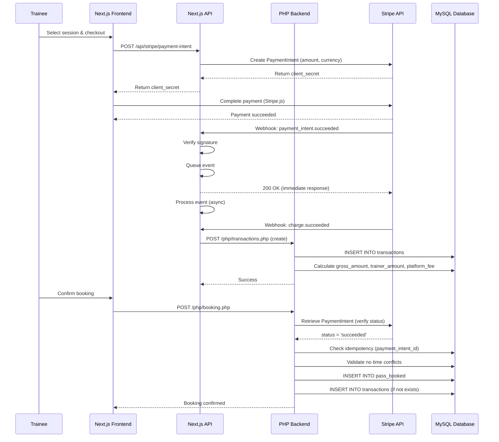

# Payment Processing (Stripe Integration)

This document describes the complete Stripe payment flow in Traino, including PaymentIntents, webhooks, revenue splits, payouts, refunds, and dispute handling.

---

## Overview

Traino uses **Stripe** for all payment processing with the following model:

- **Payment Method**: PaymentIntents API (supports 3D Secure, SCA compliance)
- **Revenue Model**: 85% to trainer, 15% platform fee
- **Payout Method**: Stripe Connect (Separate Charges & Transfers) with monthly transfers
- **Idempotency**: Unique constraints on `payment_intent_id` and `idempotency_key`
- **Currency**: SEK (Swedish Krona), amounts stored in öre (1 SEK = 100 öre)

---

## Payment Flow Diagram



---

## Step-by-Step Payment Flow

### 1. Create PaymentIntent

**Endpoint**: `/app/api/stripe/payment-intent/route.js`

**Client Request**:

```javascript
const response = await fetch('/api/stripe/payment-intent', {
  method: 'POST',
  headers: { 'Content-Type': 'application/json' },
  body: JSON.stringify({
    amount: 50000, // 500 SEK in öre
    currency: 'sek'
  })
});
const { clientSecret } = await response.json();
```

**Server Logic**:

```javascript
const paymentIntent = await stripe.paymentIntents.create({
  amount,
  currency,
  automatic_payment_methods: { enabled: true }
});
return { clientSecret: paymentIntent.client_secret };
```

**What This Does**:

- Creates a Stripe PaymentIntent in `requires_payment_method` status
- Returns `client_secret` (e.g., `pi_xxx_secret_yyy`) to frontend
- No database interaction yet

---

### 2. Complete Payment (Client-Side)

**Frontend Code** (React + Stripe.js):

```javascript
import { CardElement, useStripe, useElements } from '@stripe/react-stripe-js';

const stripe = useStripe();
const elements = useElements();

const { error, paymentIntent } = await stripe.confirmCardPayment(clientSecret, {
  payment_method: {
    card: elements.getElement(CardElement),
    billing_details: { email: userEmail }
  }
});

if (error) {
  // Handle error
} else if (paymentIntent.status === 'succeeded') {
  // Payment successful, proceed to booking
  await createBooking(paymentIntent.id);
}
```

**What Happens**:

- Stripe.js submits payment method to Stripe servers
- 3D Secure (SCA) triggered if required
- PaymentIntent transitions: `requires_payment_method` → `processing` → `succeeded`
- Stripe fires webhooks: `payment_intent.created`, `payment_intent.succeeded`, `charge.succeeded`

---

### 3. Webhook Processing

**Endpoint**: `/app/api/stripe/route.js`

**Supported Events**:

| Event | Handler | Action |
|-------|---------|--------|
| `payment_intent.created` | `handlePaymentIntentCreated` | Log event |
| `payment_intent.succeeded` | `handlePaymentIntentSucceeded` | Update global state |
| `charge.succeeded` | `handleChargeSucceeded` | Create transaction record |
| `charge.updated` | `handleChargeUpdated` | Update transaction |
| `checkout.session.completed` | `handleCheckoutSessionCompleted` | Legacy checkout (unused) |

**Webhook Verification**:

```javascript
const sig = req.headers.get('stripe-signature');
const event = stripe.webhooks.constructEvent(
  rawBody,
  sig,
  process.env.STRIPE_WEBHOOK_SECRET
);
```

**Queue System**:

```javascript
class QueueEvent {
  constructor(maxConcurrency = 10) {
    this.queue = [];
    this.maxRetries = 3;
    this.retryDelay = 2000; // Exponential backoff
  }
  
  async addEvent(event, res) {
    this.queue.push({ event, res, retries: 0 });
    this.processQueue(); // Non-blocking
  }
}
```

**Why Queue?**:

- Immediate `200 OK` response to Stripe (prevents timeout/retry storms)
- Asynchronous processing with retry logic
- Prevents webhook blocking under high load

---

### 4. Transaction Creation

**Endpoint**: `/php/transactions.php?crud=create`

**Handler**: `handleChargeSucceeded` in `/app/api/stripe/stripeHandlers.js`

**Request Body**:

```json
{
  "trainee_id": 123,
  "trainer_id": 456,
  "session_id": "abc123",
  "charge_id": "ch_xxx",
  "payment_intent_id": "pi_xxx",
  "status": "completed",
  "receipt_url": "https://pay.stripe.com/receipts/...",
  "productinfo": "trainingpass",
  "price": 500,
  "email": "trainee@example.com",
  "booked_date": "2025-10-31"
}
```

**PHP Logic** (`/php/transactions.php`):

```php
$gross_amount = $price * 100; // SEK to öre
$trainer_amount = (int) round($gross_amount * 0.85); // 85%
$platform_fee = $gross_amount - $trainer_amount; // 15%

$sql = "INSERT INTO transactions (
    trainee_id, trainer_id, session_id, charge_id, payment_intent_id,
    status, receipt_url, productinfo, price,
    gross_amount, trainer_amount, platform_fee,
    payout_status, email, booked_date
) VALUES (
    :trainee_id, :trainer_id, :session_id, :charge_id, :payment_intent_id,
    :status, :receipt_url, :productinfo, :price,
    :gross_amount, :trainer_amount, :platform_fee,
    'pending', :email, :booked_date
)";
```

**Idempotency Check**:

```php
try {
    $stmt->execute();
} catch (PDOException $e) {
    if ($e->getCode() == 23000) { // Duplicate key
        sendJson(['success' => true, 'message' => 'Transaction already exists']);
    }
    throw $e;
}
```

---

### 5. Booking Confirmation

**Endpoint**: `/php/booking.php`

**Request Body**:

```json
{
  "user_id": 123,
  "booking": {
    "trainer_id": 456,
    "product_id": 789,
    "product_type": "trainingpass",
    "category_link": "yoga",
    "price": 500,
    "pass_set_id": 101,
    "pass_repeat_id": "abc123",
    "start": "2025-10-31 10:00:00",
    "end": "2025-10-31 11:00:00",
    "payment_intent_id": "pi_xxx"
  }
}
```

**PHP Logic**:

```php
// 1. Verify payment with Stripe
\Stripe\Stripe::setApiKey($stripeSecret);
$pi = \Stripe\PaymentIntent::retrieve($payment_intent_id);
if ($pi->status !== 'succeeded') {
    sendJsonError('Payment not completed. Current status: ' . $pi->status);
}

// 2. Idempotency check
$dupCheck = $pdo->prepare("SELECT id FROM pass_booked WHERE payment_intent_id = :pid");
$dupCheck->execute([':pid' => $payment_intent_id]);
if ($dupCheck->fetch()) {
    sendJson(['success' => true, 'message' => 'Booking already exists']);
}

// 3. Conflict detection
$sql = "SELECT * FROM pass_booked
        WHERE trainer_id = :trainer_id
          AND booked_date = :booked_date
          AND canceled = 0
          AND (:starttime < endtime AND :endtime > starttime)";
if ($stmt->rowCount() > 0) {
    sendJsonError('Time slot conflict detected');
}

// 4. Insert booking
$sql = "INSERT INTO pass_booked (
    user_id, product_type, product_id, trainer_id,
    pass_set_id, pass_set_repeat_id,
    booked_date, starttime, endtime, payment_intent_id
) VALUES (...)";
```

---

## Revenue Split (85/15 Model)

### Calculation

**Example**: 500 SEK session

```
Gross Amount:    500 SEK = 50,000 öre
Trainer Amount:  50,000 × 0.85 = 42,500 öre (425 SEK)
Platform Fee:    50,000 - 42,500 = 7,500 öre (75 SEK)
```

### Database Storage

| Field | Value | Description |
|-------|-------|-------------|
| `gross_amount` | 50000 | Full amount paid by trainee (öre) |
| `trainer_amount` | 42500 | 85% owed to trainer (öre) |
| `platform_fee` | 7500 | 15% platform revenue (öre) |
| `payout_status` | `pending` | Awaiting monthly transfer |

### Stripe Account Balance

- **Immediate**: Full `gross_amount` lands in Traino's Stripe account
- **Monthly Transfer**: `trainer_amount` transferred to trainer's connected account
- **Platform Fee**: Remains in Traino's balance for withdrawals

---

## Monthly Payout Process

**Script**: `/php/transferpayoutsstripe.php`

**Execution**: Cron job on 28th of each month

**Logic**:

```php
// 1. Query pending payouts (booked before 27th)
$sql = "SELECT trainer_id, SUM(trainer_amount) AS total_owed,
               GROUP_CONCAT(id) AS transaction_ids
        FROM transactions
        WHERE payout_status = 'pending'
          AND booked_date <= :cutoff
          AND trainer_id IN (SELECT id FROM users WHERE stripe_id IS NOT NULL)
        GROUP BY trainer_id";

// 2. For each trainer
foreach ($payoutGroups as $group) {
    $trainerId = $group['trainer_id'];
    $trainerStripeId = $group['trainer_stripe_id'];
    $totalOwed = $group['total_owed']; // Sum of trainer_amount in öre
    
    // 3. Generate UUID idempotency key
    $idempotencyKey = vsprintf('%s%s-%s-%s-%s-%s%s%s', str_split(bin2hex(random_bytes(16)), 4));
    
    // 4. Create Stripe Transfer
    $transfer = \Stripe\Transfer::create([
        'amount' => $totalOwed,
        'currency' => 'sek',
        'destination' => $trainerStripeId,
        'description' => "Monthly payout for trainer $trainerId"
    ], ['idempotency_key' => $idempotencyKey]);
    
    // 5. Update transactions
    $updateSql = "UPDATE transactions
                  SET payout_status = 'completed',
                      stripe_transfer_id = :transfer_id,
                      payout_date = NOW()
                  WHERE id IN (:transaction_ids)";
}
```

**Error Handling**:

- **Missing `stripe_id`**: Skip trainer, log warning
- **Insufficient balance**: Payout fails, set `payout_status = 'failed'`
- **Network error**: Retry with same idempotency key (Stripe deduplicates)

---

## Refunds

**Manual Refunds** (via Stripe Dashboard or API):

```php
// Full refund
$refund = \Stripe\Refund::create([
    'payment_intent' => 'pi_xxx'
]);

// Partial refund
$refund = \Stripe\Refund::create([
    'payment_intent' => 'pi_xxx',
    'amount' => 25000 // 250 SEK in öre
]);
```

**Database Update**:

```php
// Update transaction status
UPDATE transactions
SET status = 'refunded', payout_status = 'failed'
WHERE payment_intent_id = 'pi_xxx';

// Cancel booking
UPDATE pass_booked
SET canceled = 1, reason = 'Refunded by admin'
WHERE payment_intent_id = 'pi_xxx';
```

**Revenue Impact**:

- Full refund: Deducted from Traino's Stripe balance
- If trainer already paid out: Manual reclaim process (outside Stripe)

---

## Dispute Handling

**Stripe Dashboard Alerts**: Email notifications on disputes

**Resolution Process**:

1. **Evidence Submission** (Stripe Dashboard):
   - Proof of service (booking confirmation, session completion)
   - Communication logs (chat, email)
   - Terms of service acceptance

2. **Database Logging** (manual):
   ```sql
   INSERT INTO admin_notes (transaction_id, note, created_at)
   VALUES (123, 'Dispute opened: Trainee claims no-show', NOW());
   ```

3. **Outcome**:
   - **Win**: No action needed, funds retained
   - **Lose**: Stripe debits account, update transaction status to `disputed_lost`

**Automation TODO**:

<!-- TODO: Implement dispute webhook handler -->
- Add `dispute.created`, `dispute.closed` webhook handlers
- Auto-pause payouts for disputed transactions

---

## Testing (Stripe Test Mode)

### Test Cards

| Card Number | Scenario |
|-------------|----------|
| `4242 4242 4242 4242` | Successful payment |
| `4000 0025 0000 3155` | Requires 3D Secure authentication |
| `4000 0000 0000 9995` | Declined (insufficient funds) |
| `4000 0000 0000 0002` | Declined (generic) |

### Test Webhooks

```bash
# Install Stripe CLI
stripe login

# Forward webhooks to localhost
stripe listen --forward-to https://localhost:3000/api/stripe

# Trigger test event
stripe trigger payment_intent.succeeded
```

### Verify Webhook Signature

```bash
# Get signing secret from Stripe CLI output
export STRIPE_WEBHOOK_SECRET=whsec_xxx

# Test webhook endpoint
curl -X POST https://localhost:3000/api/stripe \
  -H "Content-Type: application/json" \
  -H "Stripe-Signature: t=xxx,v1=xxx" \
  --data @test_webhook.json
```

---

## Production Checklist

- [ ] Set live Stripe API keys (`STRIPE_SECRET_KEY`, `STRIPE_PUBLISHABLE_KEY`)
- [ ] Configure webhook endpoint in Stripe Dashboard (`https://traino.nu/api/stripe`)
- [ ] Set `STRIPE_WEBHOOK_SECRET` from Dashboard webhook settings
- [ ] Enable Stripe Connect for trainers (Express accounts recommended)
- [ ] Test full payment flow with real card (small amount)
- [ ] Verify webhooks arrive and process correctly
- [ ] Configure email notifications for disputes
- [ ] Set up monthly cron job for `/php/transferpayoutsstripe.php`
- [ ] Monitor Stripe Dashboard for failed payments/transfers

---

## Security Best Practices

1. **Never Log Sensitive Data**:
   - Avoid logging full card numbers, CVV, or raw webhook payloads
   - Use Stripe Dashboard for payment details

2. **Webhook Signature Verification**:
   - Always verify `Stripe-Signature` header
   - Reject requests with invalid signatures

3. **Idempotency**:
   - Use unique constraints on `payment_intent_id`
   - Generate UUIDs for `idempotency_key` on transfers

4. **PCI Compliance**:
   - Never handle raw card data (Stripe.js handles this)
   - Use Stripe-hosted checkout for maximum compliance

5. **API Key Rotation**:
   - Rotate keys annually or on suspected breach
   - Use restricted API keys (limit permissions in Dashboard)

---

## Troubleshooting

### "Payment not completed" error during booking

- **Cause**: PaymentIntent still in `processing` or `requires_action` state
- **Fix**: Wait for `payment_intent.succeeded` webhook, then retry booking

### Duplicate booking errors

- **Cause**: Multiple booking attempts with same `payment_intent_id`
- **Fix**: Check idempotency logic in `/php/booking.php`, return existing booking ID

### Payout failures ("Insufficient balance")

- **Cause**: Platform fee + previous payouts exceed Stripe balance
- **Fix**: Transfer funds to Stripe account, retry payout script with `--force` flag

### Webhook timeouts (Stripe retries)

- **Cause**: Slow database queries blocking response
- **Fix**: Queue system already implemented, check `maxConcurrency` setting

---

## Related Documentation

- [Architecture Overview](ARCHITECTURE.md)
- [Database Schema](DATABASE.md)
- [Webhooks](WEBHOOKS.md)
- [Scheduling](SCHEDULING.md)
- [Security](../SECURITY.md)

---

**Last Updated**: 2025-11-03
