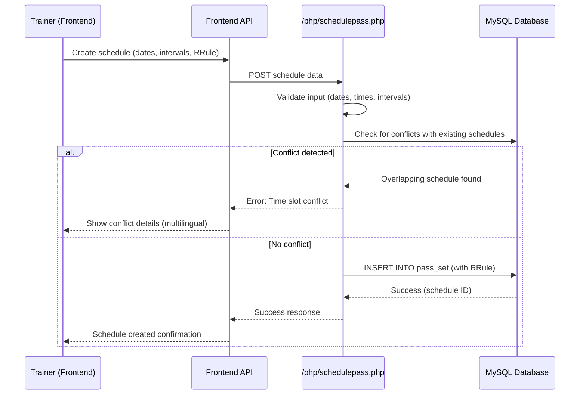
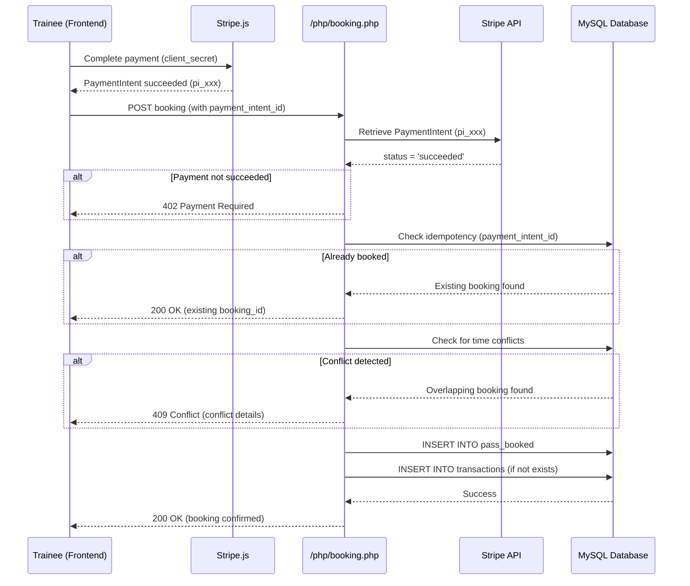

# Scheduling & Bookings System

This document describes the calendar/session management system in Traino, including schedule creation, booking flow, conflict detection, recurring events (RRule), and confirmation logic.

---

## Overview

Traino's scheduling system allows trainers to define their availability and trainees to book sessions. The system supports:

- **One-time schedules**: Single date/time slots
- **Recurring schedules**: Weekly patterns with RRule (RFC 5545)
- **Exception rules**: Exclude specific dates from recurring schedules
- **Conflict detection**: Prevents double-booking at database level
- **PaymentIntent integration**: Bookings tied to confirmed payments

---

## System Components

### Frontend

| Component | Technology | Purpose |
|-----------|------------|---------|
| Trainer Calendar | FullCalendar | Create/edit schedules with visual interface |
| Trainee Booking | React-Big-Calendar | View trainer availability, select time slots |
| Recurring Events | RRule.js | Generate recurring schedules (RFC 5545 format) |

### Backend

| Endpoint | Purpose |
|----------|---------|
| `/php/schedulepass.php` | Create/update trainer schedules (pass_set) |
| `/php/editcalendar.php` | Edit existing schedules |
| `/php/getschedule.php` | Fetch trainer availability |
| `/php/booking.php` | Confirm trainee booking (pass_booked) |
| `/php/cancel_booking.php` | Cancel existing booking |

### Database Tables

| Table | Purpose |
|-------|---------|
| `pass_set` | Trainer availability schedules |
| `pass_booked` | Confirmed bookings (trainee → trainer) |

---

## Schedule Creation Flow



---

## Data Model

### pass_set (Trainer Schedules)

**Example: One-Time Schedule**

```json
{
  "user_id": 456,
  "product_id": 789,
  "product_type": "trainingpass",
  "category_link": "yoga",
  "startdate": "2025-11-01",
  "enddate": "2025-11-01",
  "isrepeat": 0,
  "intervals": [
    {"day": "Friday", "start": "10:00", "end": "11:00"},
    {"day": "Friday", "start": "14:00", "end": "15:00"}
  ]
}
```

**Example: Recurring Schedule (Weekly)**

```json
{
  "user_id": 456,
  "product_id": 789,
  "product_type": "trainingpass",
  "category_link": "yoga",
  "pass_repeat_id": "abc123-recurring-uuid",
  "rrule": "FREQ=WEEKLY;BYDAY=MO,WE,FR;UNTIL=20251231T235959Z",
  "startdate": "2025-11-01",
  "enddate": "2025-12-31",
  "isrepeat": 1,
  "intervals": [
    {"day": "Monday", "start": "09:00", "end": "10:00"},
    {"day": "Wednesday", "start": "09:00", "end": "10:00"},
    {"day": "Friday", "start": "09:00", "end": "10:00"}
  ]
}
```

**RRule Explanation**:

- `FREQ=WEEKLY`: Repeats every week
- `BYDAY=MO,WE,FR`: On Monday, Wednesday, Friday
- `UNTIL=20251231T235959Z`: Ends on 2025-12-31

### pass_booked (Confirmed Bookings)

**Example**:

```json
{
  "user_id": 123,
  "trainer_id": 456,
  "product_id": "product-uuid-789",
  "product_type": "trainingpass",
  "pass_set_id": 101,
  "pass_set_repeat_id": "abc123-recurring-uuid",
  "booked_date": "2025-11-04",
  "starttime": "09:00:00",
  "endtime": "10:00:00",
  "payment_intent_id": "pi_xxx",
  "paid": 1,
  "canceled": 0
}
```

---

## Conflict Detection

### Schedule vs. Schedule (Trainer Side)

**Scenario**: Trainer creates overlapping schedules for same product.

**Logic** (`/php/schedulepass.php`):

```php
// For each new interval
foreach ($newSchedule['intervals'] as $newInterval) {
    // Query existing schedules for same trainer
    $sql = "SELECT * FROM pass_set
            WHERE user_id = :trainer_id
              AND deleted = 0
              AND (
                  (startdate <= :new_end AND enddate >= :new_start)
              )";
    
    $existingSchedules = $stmt->fetchAll();
    
    foreach ($existingSchedules as $existing) {
        $existingIntervals = json_decode($existing['intervals'], true);
        
        foreach ($existingIntervals as $existingInterval) {
            if ($newInterval['day'] === $existingInterval['day']) {
                // Check time overlap
                if (timeOverlaps(
                    $newInterval['start'], $newInterval['end'],
                    $existingInterval['start'], $existingInterval['end']
                )) {
                    $error = [
                        'en' => "Conflict: {$newInterval['start']}-{$newInterval['end']} on {$newInterval['day']} overlaps with {$existingInterval['start']}-{$existingInterval['end']}",
                        'sv' => "Konflikt: {$newInterval['start']}-{$newInterval['end']} på {$newInterval['day']} överlappar {$existingInterval['start']}-{$existingInterval['end']}"
                    ];
                    sendJsonError(json_encode($error));
                }
            }
        }
    }
}

function timeOverlaps($start1, $end1, $start2, $end2) {
    return ($start1 < $end2) && ($end1 > $start2);
}
```

**Error Response**:

```json
{
  "error": {
    "en": "Time slot conflict detected! Your new schedule (10:00 - 11:00) on Monday overlaps with existing schedule (09:00 - 12:00) at Yoga Studio.",
    "sv": "Tidskonflikt upptäckt! Din nya schema (10:00 - 11:00) på måndag överlappar med befintlig schema (09:00 - 12:00) på Yoga Studio."
  }
}
```

---

### Booking vs. Booking (Trainee Side)

**Scenario**: Multiple trainees try to book same time slot.

**Logic** (`/php/booking.php`):

```php
$sql = "SELECT * FROM pass_booked
        WHERE trainer_id = :trainer_id
          AND booked_date = :booked_date
          AND canceled = 0
          AND ispause = 0
          AND (
              :starttime < endtime AND :endtime > starttime
          )";

$stmt->execute([
    ':trainer_id' => $trainer_id,
    ':booked_date' => $booked_date,
    ':starttime' => $starttime,
    ':endtime' => $endtime
]);

if ($stmt->rowCount() > 0) {
    $conflictDetails = [];
    foreach ($stmt->fetchAll() as $booking) {
        $conflictDetails[] = "{$booking['starttime']} - {$booking['endtime']}";
    }
    
    $error = [
        'en' => "Time slot conflict. Requested: {$starttime} - {$endtime}. Overlaps: " . implode(", ", $conflictDetails),
        'sv' => "Tidskonflikt. Begärd: {$starttime} - {$endtime}. Överlappar: " . implode(", ", $conflictDetails)
    ];
    
    http_response_code(409); // Conflict
    sendJsonError(json_encode($error));
}
```

**Race Condition Handling**:

- **Database-level**: Transaction isolation prevents simultaneous inserts
- **Application-level**: PaymentIntent idempotency ensures only one booking per payment

---

## Booking Confirmation Flow



---

## PaymentIntent Verification

**Why Verify?**: Prevents free bookings via API abuse.

**Logic** (`/php/booking.php`):

```php
// Load Stripe secret key
$stripeSecret = defined('STRIPE_KEY') ? STRIPE_KEY : getenv('STRIPE_SECRET_KEY');
if (!$stripeSecret) {
    sendJsonError('Stripe secret key not configured');
}

// Initialize Stripe SDK
\Stripe\Stripe::setApiKey($stripeSecret);

// Retrieve PaymentIntent from Stripe
try {
    $pi = \Stripe\PaymentIntent::retrieve($payment_intent_id);
} catch (\Stripe\Exception\ApiErrorException $e) {
    http_response_code(400);
    sendJsonError('Stripe API error: ' . $e->getMessage());
}

// Verify status
if (!$pi || !isset($pi->status)) {
    http_response_code(400);
    sendJsonError('Unable to verify payment status');
}

if ($pi->status !== 'succeeded') {
    http_response_code(402); // Payment Required
    sendJsonError('Payment not completed. Current status: ' . $pi->status);
}

// Proceed with booking...
```

**PaymentIntent Statuses**:

| Status | Meaning | Action |
|--------|---------|--------|
| `succeeded` | Payment confirmed | Allow booking |
| `requires_payment_method` | Awaiting payment | Reject (402) |
| `requires_action` | 3D Secure pending | Reject (402) |
| `processing` | Processing payment | Reject (402), retry later |
| `canceled` | Payment canceled | Reject (400) |

---

## Cancellation Flow

**Endpoint**: `/php/cancel_booking.php`

**Request**:

```json
{
  "booking_id": 123,
  "reason": "Trainer unavailable"
}
```

**Logic**:

```php
$sql = "UPDATE pass_booked
        SET canceled = 1, reason = :reason
        WHERE id = :booking_id
          AND user_id = :user_id";

// Optional: Trigger refund via Stripe
$booking = getBookingById($booking_id);
$refund = \Stripe\Refund::create([
    'payment_intent' => $booking['payment_intent_id']
]);

// Update transaction status
$sql = "UPDATE transactions
        SET status = 'refunded', payout_status = 'failed'
        WHERE payment_intent_id = :payment_intent_id";
```

**Refund Policy**:

- **24+ hours before session**: Full refund (minus Stripe fee)
- **<24 hours before session**: 50% refund
- **No-show**: No refund

<!-- TODO: Implement automated refund policy logic -->

---

## Recurring Events (RRule)

### RRule Format

Based on [RFC 5545 (iCalendar)](https://tools.ietf.org/html/rfc5545#section-3.8.5.3).

**Examples**:

```
# Every Monday, Wednesday, Friday
FREQ=WEEKLY;BYDAY=MO,WE,FR

# Every 2 weeks on Tuesday
FREQ=WEEKLY;INTERVAL=2;BYDAY=TU

# First Monday of each month
FREQ=MONTHLY;BYDAY=1MO

# Daily for 30 occurrences
FREQ=DAILY;COUNT=30

# Weekly until specific date
FREQ=WEEKLY;UNTIL=20251231T235959Z
```

### Frontend Generation

**Using RRule.js**:

```javascript
import { RRule } from 'rrule';

const rule = new RRule({
  freq: RRule.WEEKLY,
  byweekday: [RRule.MO, RRule.WE, RRule.FR],
  dtstart: new Date('2025-11-01'),
  until: new Date('2025-12-31')
});

const rruleString = rule.toString();
// Output: "FREQ=WEEKLY;BYDAY=MO,WE,FR;DTSTART=20251101T000000Z;UNTIL=20251231T235959Z"

// Get all occurrences
const dates = rule.all();
console.log(dates); // [Date, Date, Date, ...]
```

### Backend Storage

```sql
INSERT INTO pass_set (
    user_id, product_id, pass_repeat_id,
    rrule, startdate, enddate, isrepeat, intervals
) VALUES (
    456, 789, 'recurring-uuid',
    'FREQ=WEEKLY;BYDAY=MO,WE,FR;UNTIL=20251231T235959Z',
    '2025-11-01', '2025-12-31', 1,
    '[{"day":"Monday","start":"09:00","end":"10:00"},...]'
);
```

### Exception Rules (EXDATE)

**Exclude specific dates from recurring schedule**:

```sql
UPDATE pass_set
SET exrules = 'EXDATE:20251224T000000Z,20251225T000000Z'
WHERE id = 101;
```

**Frontend Display**:

```javascript
const rule = RRule.fromString('FREQ=WEEKLY;BYDAY=MO,WE,FR');
const exdates = [new Date('2025-12-24'), new Date('2025-12-25')];

const dates = rule.all().filter(date => !exdates.includes(date));
```

---

## Calendar UI Integration

### Trainer Side (FullCalendar)

**Display Availability**:

```javascript
import FullCalendar from '@fullcalendar/react';
import timeGridPlugin from '@fullcalendar/timegrid';
import rrulePlugin from '@fullcalendar/rrule';

<FullCalendar
  plugins={[timeGridPlugin, rrulePlugin]}
  initialView="timeGridWeek"
  events={[
    {
      title: 'Yoga Class',
      rrule: 'FREQ=WEEKLY;BYDAY=MO,WE,FR',
      duration: '01:00',
      startTime: '09:00',
      color: '#4caf50'
    }
  ]}
/>
```

**Create Schedule**:

```javascript
const handleDateSelect = (selectInfo) => {
  const startDate = selectInfo.start;
  const endDate = selectInfo.end;
  
  // Open modal to set recurring pattern
  setScheduleModal({
    start: startDate,
    end: endDate,
    isRecurring: false
  });
};
```

---

### Trainee Side (React-Big-Calendar)

**Display Trainer Availability**:

```javascript
import { Calendar, momentLocalizer } from 'react-big-calendar';
import moment from 'moment';

const localizer = momentLocalizer(moment);

<Calendar
  localizer={localizer}
  events={trainerSchedules}
  views={['month', 'week', 'day']}
  onSelectSlot={(slotInfo) => {
    // Open booking modal
    setSelectedSlot(slotInfo);
  }}
  selectable
/>
```

**Fetch Schedules**:

```javascript
const fetchSchedules = async (trainerId) => {
  const response = await fetch(`/php/getschedule.php?trainer_id=${trainerId}`);
  const schedules = await response.json();
  
  // Expand recurring schedules
  const events = schedules.flatMap(schedule => {
    if (schedule.isrepeat && schedule.rrule) {
      const rule = RRule.fromString(schedule.rrule);
      return rule.all().map(date => ({
        title: schedule.title,
        start: new Date(date + ' ' + schedule.intervals[0].start),
        end: new Date(date + ' ' + schedule.intervals[0].end),
        resource: schedule
      }));
    } else {
      return schedule.intervals.map(interval => ({
        title: schedule.title,
        start: new Date(schedule.startdate + ' ' + interval.start),
        end: new Date(schedule.startdate + ' ' + interval.end),
        resource: schedule
      }));
    }
  });
  
  return events;
};
```

---

## Database Cleanup (Cron)

**Daily Duty** (`/php/dailyduty.php`):

```php
// Delete expired schedules (enddate < today)
$currentDate = date('Y-m-d');
$deleteSql = "DELETE FROM pass_set
              WHERE enddate < :currentDate
                AND enddate IS NOT NULL";
$stmt = $pdo->prepare($deleteSql);
$stmt->execute([':currentDate' => $currentDate]);
```

**Scheduled Cleanup**:

- **Daily**: Remove expired schedules
- **Weekly**: Archive old bookings (>90 days)
- **Monthly**: Delete soft-deleted products with no bookings

---

## Testing Scenarios

### 1. Simple Booking

```bash
# 1. Create PaymentIntent
curl -X POST https://traino.nu/api/stripe/payment-intent \
  -d '{"amount":50000,"currency":"sek"}'
# Response: {"clientSecret":"pi_xxx_secret_yyy"}

# 2. Complete payment (via Stripe.js in browser)

# 3. Confirm booking
curl -X POST https://traino.nu/php/booking.php \
  -H "Authorization: Bearer $API_KEY" \
  -d '{
    "user_id": 123,
    "booking": {
      "trainer_id": 456,
      "product_id": 789,
      "start": "2025-11-01 10:00:00",
      "end": "2025-11-01 11:00:00",
      "payment_intent_id": "pi_xxx"
    }
  }'
```

### 2. Recurring Schedule Creation

```bash
curl -X POST https://traino.nu/php/schedulepass.php \
  -H "Authorization: Bearer $API_KEY" \
  -d '{
    "user_id": 456,
    "product_id": 789,
    "rrule": "FREQ=WEEKLY;BYDAY=MO,WE,FR",
    "startdate": "2025-11-01",
    "enddate": "2025-12-31",
    "isrepeat": 1,
    "intervals": [
      {"day":"Monday","start":"09:00","end":"10:00"},
      {"day":"Wednesday","start":"09:00","end":"10:00"},
      {"day":"Friday","start":"09:00","end":"10:00"}
    ]
  }'
```

### 3. Conflict Detection

```bash
# Attempt to book already-taken slot
curl -X POST https://traino.nu/php/booking.php \
  -H "Authorization: Bearer $API_KEY" \
  -d '{
    "user_id": 124,
    "booking": {
      "trainer_id": 456,
      "start": "2025-11-01 10:00:00",
      "end": "2025-11-01 11:00:00",
      "payment_intent_id": "pi_yyy"
    }
  }'
# Expected: 409 Conflict error
```

---

## Related Documentation

- [Payment Processing](PAYMENTS.md)
- [Database Schema](DATABASE.md)
- [Architecture Overview](ARCHITECTURE.md)
- [Webhooks](WEBHOOKS.md)

---

**Last Updated**: 2025-11-03
