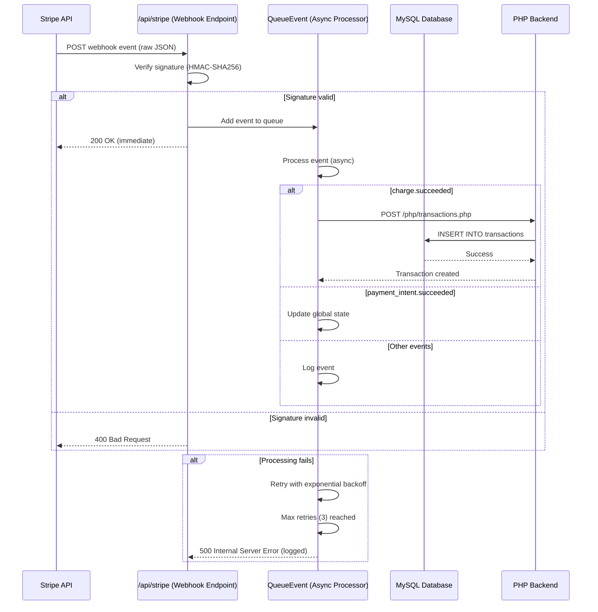

# Stripe Webhooks

This document details all Stripe webhook event handlers, idempotency mechanisms, retry logic, error handling, and verification procedures in the Traino system.

---

## Overview

Traino uses Stripe webhooks to receive real-time notifications about payment events. All webhooks are handled by a centralized endpoint with queued processing, signature verification, and automatic retries.

**Webhook Endpoint**: `/app/api/stripe/route.js`

**Key Features**:

- Signature verification (HMAC-SHA256)
- Asynchronous queue processing (max concurrency: 10)
- Exponential backoff retry logic (max 3 retries)
- Immediate `200 OK` response to prevent Stripe retries
- Event deduplication via unique indexes

---

## Supported Webhook Events

| Event Type | Handler Function | Action Taken |
|------------|------------------|--------------|
| `payment_intent.created` | `handlePaymentIntentCreated` | Log event for debugging |
| `payment_intent.succeeded` | `handlePaymentIntentSucceeded` | Update global state with PI ID |
| `charge.succeeded` | `handleChargeSucceeded` | Create transaction record in DB |
| `charge.updated` | `handleChargeUpdated` | Update transaction metadata |
| `charge.refunded` | `handleChargeRefunded` | Mark transaction as refunded in DB |
| `charge.refund.updated` | `handleChargeRefundUpdated` | Update refund details in DB |
| `checkout.session.completed` | `handleCheckoutSessionCompleted` | Legacy (unused, logs metadata) |
| `product.created` | `handleProductCreated` | Log product creation |
| `product.updated` | `handleProductUpdated` | Log product updates |
| `product.deleted` | `handleProductDeleted` | Log product deletion |
| `price.created` | `handlePriceCreated` | Log price creation |
| `price.updated` | `handlePriceUpdated` | Log price updates |
| `price.deleted` | `handlePriceDeleted` | Log price deletion |

**Note**: Product and price events are for future Stripe Product integration (not currently used in booking flow).

---

## Refund Event Handlers

### 5. charge.refunded

**Purpose**: Handle full or partial refunds initiated via Stripe Dashboard or API.

**Handler**: `handleChargeRefunded` in `/app/api/stripe/stripeHandlers.js`

**Logic**:

```javascript
export async function handleChargeRefunded(charge) {
  try {
    const payment_intent_id = charge.payment_intent;
    const refunds = (charge.refunds && charge.refunds.data) || [];
    const latestRefund = refunds[0] || null;

    await sendRefundUpdateToDatabase({
      payment_intent_id,
      refund_id: latestRefund ? latestRefund.id : undefined,
      refund_amount: latestRefund ? latestRefund.amount : undefined,
      refund_receipt_url: charge.receipt_url || null,
      refunded_at: latestRefund ? new Date(latestRefund.created * 1000).toISOString() : new Date().toISOString(),
      reason: 'refunded_via_webhook',
    });
  } catch (err) {
    console.error('handleChargeRefunded error:', err);
  }
}
```

**Database Call**: `POST /php/transactions.php?crud=mark_refunded`

**Updates**:

- Sets transaction `status = 'refunded'`
- Sets `payout_status = 'failed'` (prevents payout of refunded funds)
- Stores refund metadata in `info` field

### 6. charge.refund.updated

**Purpose**: Handle updates to existing refunds (e.g., status changes).

**Handler**: `handleChargeRefundUpdated` in `/app/api/stripe/stripeHandlers.js`

**Logic**:

```javascript
export async function handleChargeRefundUpdated(refund) {
  try {
    const payment_intent_id = refund.payment_intent;
    await sendRefundUpdateToDatabase({
      payment_intent_id,
      refund_id: refund.id,
      refund_amount: refund.amount,
      refund_receipt_url: null,
      refunded_at: new Date(refund.created * 1000).toISOString(),
      reason: 'refund_updated_via_webhook',
    });
  } catch (err) {
    console.error('handleChargeRefundUpdated error:', err);
  }
}
```

**Use Case**: Tracks refund status changes (pending → succeeded → failed).

---

## Webhook Flow Diagram



---

## Signature Verification

### Why Verify Signatures?

- **Security**: Prevents spoofed webhook requests from malicious actors
- **Integrity**: Ensures payload hasn't been tampered with in transit
- **Authenticity**: Confirms request originated from Stripe

### Verification Process

```javascript
// 1. Extract raw request body (MUST be raw bytes, not parsed JSON)
const rawBody = await req.text();

// 2. Get Stripe signature from header
const sig = req.headers.get('stripe-signature');

// 3. Construct event (verifies signature internally)
const event = stripe.webhooks.constructEvent(
  rawBody,
  sig,
  process.env.STRIPE_WEBHOOK_SECRET
);
```

### Signature Header Format

```
Stripe-Signature: t=1609459200,v1=abc123def456...,v0=older_sig
```

- `t`: Timestamp (Unix epoch seconds)
- `v1`: Current signature scheme (HMAC-SHA256)
- `v0`: Legacy signature (ignored)

### Error Handling

```javascript
try {
  event = stripe.webhooks.constructEvent(rawBody, sig, webhookSecret);
} catch (err) {
  console.error(`❌ Webhook signature verification failed: ${err.message}`);
  return NextResponse.json({ error: 'Invalid signature' }, { status: 400 });
}
```

**Common Failures**:

- Missing `Stripe-Signature` header → 400 Bad Request
- Invalid/expired signature → 400 Bad Request
- Wrong `STRIPE_WEBHOOK_SECRET` → 400 Bad Request

---

## Queue System

### Design Rationale

**Problem**: Webhook processing can be slow (database writes, external API calls), causing:

- Stripe timeout (30-second limit)
- Automatic retries from Stripe
- Duplicate events processed

**Solution**: Queue-based asynchronous processing with immediate response.

### QueueEvent Class

```javascript
class QueueEvent {
  constructor(maxConcurrency = 10) {
    this.queue = [];
    this.isProcessing = false;
    this.maxRetries = 3;
    this.retryDelay = 2000; // Base delay (ms)
    this.activeEvents = 0;
    this.maxConcurrency = maxConcurrency;
    this.processedEvents = 0;
  }

  async addEvent(event, res) {
    this.queue.push({ event, res, retries: 0 });
    console.log(`🔔 ${event.type} added to queue. Size: ${this.queue.length}`);
    this.processQueue();
  }

  async processQueue() {
    if (this.isProcessing || this.activeEvents >= this.maxConcurrency) return;
    this.isProcessing = true;

    while (this.queue.length > 0 && this.activeEvents < this.maxConcurrency) {
      const { event, res, retries } = this.queue.shift();
      this.activeEvents++;
      
      try {
        await this.processEvent(event, res, retries);
      } finally {
        this.activeEvents--;
        this.processedEvents++;
      }
    }
    
    this.isProcessing = false;
  }

  async processEvent(event, res, retries) {
    try {
      const eventData = event.data.object;
      await eventHandlers[event.type](eventData);
      console.log(`✅ Processed: ${event.type}. Total: ${this.processedEvents + 1}`);
    } catch (err) {
      console.error(`❌ Error processing ${event.type}:`, err);
      
      if (retries < this.maxRetries) {
        const delay = this.retryDelay * Math.pow(2, retries); // Exponential backoff
        setTimeout(() => {
          this.queue.push({ event, res, retries: retries + 1 });
          this.processQueue();
        }, delay);
      } else {
        console.error(`❌ Max retries (${this.maxRetries}) reached for ${event.type}`);
      }
    }
  }
}
```

### Retry Strategy

| Attempt | Delay | Total Wait Time |
|---------|-------|-----------------|
| 1 (initial) | 0ms | 0s |
| 2 | 2000ms | 2s |
| 3 | 4000ms | 6s |
| 4 | 8000ms | 14s |

**After 3 retries**: Event discarded, error logged (manual investigation required).

---

## Event Handlers

### 1. charge.succeeded

**Purpose**: Create transaction record when payment is confirmed.

**Handler**: `handleChargeSucceeded` in `/app/api/stripe/stripeHandlers.js`

**Logic**:

```javascript
export async function handleChargeSucceeded(charge) {
  const { id, payment_intent, status, amount, receipt_url, billing_details } = charge;
  
  globalState = {
    ...globalState,
    chargeId: id,
    paymentIntentId: payment_intent,
    receiptUrl: receipt_url,
    status,
    amountTotal: amount,
    customerEmail: billing_details?.email || 'N/A'
  };

  console.log(`Charge succeeded: ${id}`);
  console.log(`Amount: ${amount / 100} SEK`);
  console.log(`Receipt URL: ${receipt_url}`);

  // Send to database
  const transactionData = {
    trainee_id: globalState.traineeId,
    trainer_id: globalState.trainerId,
    session_id: globalState.sessionId,
    charge_id: id,
    payment_intent_id: payment_intent,
    status: 'completed',
    receipt_url,
    productinfo: globalState.productInfo,
    price: amount / 100, // Convert öre to SEK
    email: billing_details?.email,
    booked_date: new Date().toISOString().split('T')[0]
  };

  await sendToDatabase(transactionData);
}
```

**Database Call**: `POST /php/transactions.php?crud=create`

**Idempotency**: Handled by unique index on `payment_intent_id` in `transactions` table.

---

### 2. payment_intent.succeeded

**Purpose**: Update internal state when payment completes.

**Handler**: `handlePaymentIntentSucceeded`

**Logic**:

```javascript
export async function handlePaymentIntentSucceeded(paymentIntent) {
  const { id, status, created } = paymentIntent;
  
  globalState = {
    ...globalState,
    paymentIntentId: id,
    status
  };

  console.log(`Payment intent succeeded: ${id}`);
  console.log(`Status: ${status}`);
  console.log(`Created: ${epochToDate(created)}`);
}
```

**Note**: Does not write to database (transaction record created by `charge.succeeded`).

---

### 3. checkout.session.completed (Legacy)

**Purpose**: Handle legacy Stripe Checkout flow (not currently used).

**Handler**: `handleCheckoutSessionCompleted`

**Logic**:

```javascript
export async function handleCheckoutSessionCompleted(session) {
  await updateGlobalStateFromSession(session);
  
  console.log(`Checkout session completed: ${session.id}`);
  console.log(`Payment Intent: ${session.payment_intent}`);
  console.log(`Amount: ${session.amount_total / 100} SEK`);
}
```

**Status**: Inactive (Traino uses direct PaymentIntent flow).

---

### 4. Product & Price Events

**Purpose**: Log Stripe Product/Price changes for debugging.

**Handlers**: `handleProductCreated`, `handleProductUpdated`, etc.

**Logic**: Simple console logging (no database writes).

**Future Use**: Sync Stripe Products with Traino's `products` table for centralized pricing.

---

## Idempotency & Deduplication

### Database-Level Idempotency

**Unique Constraints**:

1. `transactions.payment_intent_id` (UNIQUE)
   - Prevents duplicate transaction records
   - Enforced at database level

2. `pass_booked.payment_intent_id` (UNIQUE)
   - Prevents duplicate bookings
   - Checked before insert in `/php/booking.php`

### Application-Level Checks

**Transaction Creation** (`/php/transactions.php`):

```php
try {
    $stmt->execute();
} catch (PDOException $e) {
    if ($e->getCode() == 23000) { // Duplicate entry error
        sendJson(['success' => true, 'message' => 'Transaction already exists']);
        exit;
    }
    throw $e;
}
```

**Booking Creation** (`/php/booking.php`):

```php
$dupCheck = $pdo->prepare("SELECT id FROM pass_booked WHERE payment_intent_id = :pid");
$dupCheck->execute([':pid' => $payment_intent_id]);
if ($existing = $dupCheck->fetch()) {
    sendJson(['success' => true, 'message' => 'Booking already exists', 'booking_id' => $existing['id']]);
}
```

### Stripe-Level Idempotency

**Payout Transfers** (`/php/transferpayoutsstripe.php`):

```php
$idempotencyKey = vsprintf('%s%s-%s-%s-%s-%s%s%s', str_split(bin2hex(random_bytes(16)), 4));

$transfer = \Stripe\Transfer::create([
    'amount' => $totalOwed,
    'currency' => 'sek',
    'destination' => $trainerStripeId
], ['idempotency_key' => $idempotencyKey]);
```

**How It Works**:

- Same `idempotency_key` sent twice → Stripe returns original transfer (no duplicate)
- Key stored in `transactions.idempotency_key` (UNIQUE constraint)

---

## Webhook Configuration

### Stripe Dashboard Setup

1. **Navigate**: Dashboard → Developers → Webhooks
2. **Add Endpoint**:
   - URL: `https://traino.nu/api/stripe`
   - Description: "Traino production webhooks"
3. **Select Events**:
   - `payment_intent.created`
   - `payment_intent.succeeded`
   - `charge.succeeded`
   - `charge.updated`
   - (Optional) `checkout.session.completed`
4. **Copy Signing Secret**: `whsec_...` → Set as `STRIPE_WEBHOOK_SECRET` env var

### Local Development Setup

```bash
# Install Stripe CLI
stripe login

# Forward webhooks to localhost
stripe listen --forward-to https://localhost:3000/api/stripe

# Output includes signing secret (use in .env.local)
# > Ready! Your webhook signing secret is whsec_xxx
```

**Test Triggering**:

```bash
# Trigger specific event
stripe trigger payment_intent.succeeded

# Trigger with custom data
stripe trigger payment_intent.succeeded --add payment_intent:amount=50000
```

---

## Error Handling & Logging

### Webhook Rejection Scenarios

| Error | Status Code | Stripe Behavior |
|-------|-------------|-----------------|
| Missing signature header | 400 | Retry (up to 3 days) |
| Invalid signature | 400 | Retry (up to 3 days) |
| Empty request body | 400 | Retry |
| Unsupported event type | 400 | No retry (permanent failure) |
| Processing timeout (>30s) | 500 | Retry |
| Internal server error | 500 | Retry |

### Logging Best Practices

**Do Log**:

```javascript
console.log(`✅ Processed event: ${event.type}`);
console.log(`Payment Intent: ${paymentIntent.id}`);
console.log(`Amount: ${amount / 100} SEK`);
```

**Don't Log**:

```javascript
// ❌ Never log full webhook payload (may contain sensitive data)
console.log(JSON.stringify(event));

// ❌ Never log card details
console.log(charge.payment_method_details.card.number);
```

### Monitoring & Alerts

**Stripe Dashboard**:

- **Webhooks Tab**: View delivery history, retry status
- **Events Tab**: Search by `payment_intent_id`, timestamp
- **Logs Tab**: View raw request/response logs

**Application Logging**:

- **Success**: Log event type, PI ID, amount
- **Failure**: Log error message, retry count, event ID
- **Alert on**: 3 consecutive failures, unknown event types

---

## Testing Webhooks

### Test Mode Events

```bash
# Create test PaymentIntent
stripe payment_intents create --amount=50000 --currency=sek

# Simulate webhook event
stripe trigger payment_intent.succeeded --add payment_intent:id=pi_test_xxx
```

### Mock Webhook Requests

```bash
# Send test webhook to local endpoint
curl -X POST https://localhost:3000/api/stripe \
  -H "Content-Type: application/json" \
  -H "Stripe-Signature: t=$(date +%s),v1=$(echo -n "$(date +%s).{}" | openssl dgst -sha256 -hmac "whsec_test_secret" | cut -d' ' -f2)" \
  --data '{
    "id": "evt_test_123",
    "type": "payment_intent.succeeded",
    "data": {
      "object": {
        "id": "pi_test_123",
        "status": "succeeded",
        "amount": 50000
      }
    }
  }'
```

### Verify Processing

```sql
-- Check if transaction was created
SELECT * FROM transactions WHERE payment_intent_id = 'pi_test_123';

-- Check webhook logs
SELECT * FROM webhook_logs WHERE event_id = 'evt_test_123';
```

---

## Production Checklist

- [ ] Set `STRIPE_WEBHOOK_SECRET` in production environment
- [ ] Configure webhook endpoint in Stripe Dashboard (live mode)
- [ ] Test webhook delivery with `stripe trigger` in live mode
- [ ] Monitor webhook failure rate (target: <1% failure)
- [ ] Set up alerts for repeated failures (e.g., Slack, PagerDuty)
- [ ] Document runbook for webhook debugging
- [ ] Review webhook logs weekly for anomalies

---

## Troubleshooting

### "Invalid signature" errors

**Causes**:

- Wrong `STRIPE_WEBHOOK_SECRET` (test vs. live mode mismatch)
- Request body modified before verification (middleware parsing)
- Clock skew (timestamp in signature too old)

**Fix**:

```javascript
// Ensure raw body is used for verification
const rawBody = await req.text(); // NOT req.json()
```

### Events not being processed

**Causes**:

- Event type not in `eventHandlers` object
- Handler function throwing uncaught exception
- Queue overflow (max concurrency reached)

**Debug**:

```javascript
console.log(`Received event type: ${event.type}`);
console.log(`Supported handlers: ${Object.keys(eventHandlers)}`);
```

### Duplicate transactions in database

**Causes**:

- Unique index not enforced (schema issue)
- Multiple webhook retries before idempotency check
- Race condition (concurrent webhooks)

**Fix**: Verify unique indexes exist:

```sql
SHOW INDEX FROM transactions WHERE Key_name LIKE '%payment_intent_id%';
```

---

## Related Documentation

- [Payment Processing](PAYMENTS.md)
- [Database Schema](DATABASE.md)
- [Architecture Overview](ARCHITECTURE.md)
- [Security Guidelines](../SECURITY.md)

---

**Last Updated**: 2025-11-11
